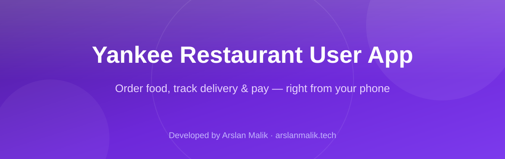
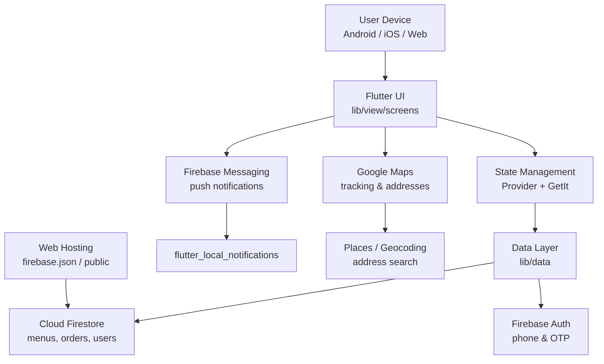

<p align="center">
  
</p>

<p align="center">
  
  
  
  
  
  
</p>

> **Developed by [Arslan Malik](https://github.com/arsalanmaalik461)**
> 📱 WhatsApp: [+92 300 8987448](https://wa.me/923008987448) · 🌐 Website: [arslanmalik.tech](https://arslanmalik.tech)

---

## 🌟 Executive Overview

Yankee Restaurant User App is a cross-platform Flutter mobile application that lets restaurant customers browse the menu, place food orders, and follow their delivery from their phone. It targets Android, iOS and web from a single Dart codebase and talks to Firebase services (Cloud Firestore, Firebase Cloud Messaging) plus Google Maps for location features.

The app covers the full customer journey: onboarding and welcome screens, phone-based authentication with OTP entry, a home screen with menus, categories, popular items and set menus, search, cart and checkout with coupons and multiple addresses, order history and live order tracking, wishlist, product reviews, in-app chat and support, notifications, multi-language support, and a profile section. State is managed with Provider and GetIt, navigation with Fluro, and push notifications are handled through Firebase Messaging with local-notification display.

> **Note:** this repository ships with the app's source code only. No live user counts, store ratings, download figures, or demo builds are claimed here — the sections below describe what is actually in the code.

---

## 📑 Table of Contents

- [✨ Key Features & Highlights](#-key-features--highlights)
- [🖥️ Feature Showcase](#️-feature-showcase)
- [🏗️ System Architecture](#️-system-architecture)
- [🚀 Quickstart & Installation Guide](#-quickstart--installation-guide)
- [📂 Project Structure](#-project-structure)
- [🛡️ Security & Notes](#️-security--notes)

---

## ✨ Key Features & Highlights

| Feature | Description |
| :--- | :--- |
| 🔐 Auth & OTP | Login/signup flow with phone number support (`phone_number`, `country_code_picker`) and OTP PIN entry (`pin_code_fields`), plus forgot-password screens. |
| 🍔 Menu & Categories | Browse menu, categories, popular items and set menus with shimmer loading placeholders (`shimmer_animation`) and carousel banners (`carousel_slider`). |
| 🛒 Cart & Checkout | Cart management, coupon support, multiple delivery addresses, and checkout with countdown timers (`circular_countdown_timer`). |
| 📦 Order Tracking | Live order tracking on Google Maps (`google_maps_flutter`, `geolocator`, `geocoding`, `flutter_google_places`) with an order-tracking screen and dashboard. |
| 🔔 Notifications | Firebase Cloud Messaging (`firebase_messaging`) with `flutter_local_notifications` for foreground display and a notification screen. |
| 💬 In-app Chat & Support | Chat module and a support screen for customer assistance. |
| ⭐ Reviews & Wishlist | Item reviews (`rare_review`) and a wishlist for saving favourite dishes. |
| 🌍 Multi-language | Localized UI via `flutter_localizations` with a language selection screen (`lib/localization`). |
| 📶 Connectivity Aware | Network-state handling with `connectivity_plus`. |
| 🖥️ Web Support | Builds for web too (`google_maps_flutter_web`, `url_strategy`, `universal_html`). |
| 🗄️ Firebase Backend | Cloud Firestore (`cloud_firestore`), Firebase Core and Messaging; web hosting config present (`firebase.json`, `.firebaserc`). |

---

## 🖥️ Feature Showcase

### 1. Customer Ordering Flow

> "Browse, order, track — the complete customer loop."

- Welcome / onboarding / splash screens lead into auth and the dashboard home.
- Menu, category, search, popular-item and set-menu screens feed a shared cart.
- Checkout collects address, applies coupons and confirms the order.
- Order, track and dashboard screens follow the order from placement to delivery.

### 2. Location & Delivery

> "Map-powered addresses and live tracking."

- Google Maps SDK with place search (`flutter_google_places`), geocoding and geolocation for picking delivery addresses.
- Live tracking view so customers can watch their order on the map.
- Address management with multiple saved addresses.

### 3. Engagement & Extras

> "Reviews, wishlist, chat, notifications."

- Push notifications via FCM with local notification rendering.
- Wishlist, item reviews, in-app chat and a support screen.
- Multi-language UI and profile management.

---

## 🏗️ System Architecture



---

## 🚀 Quickstart & Installation Guide

### Prerequisites

- Flutter SDK (project SDK constraint: `>=2.7.0 <3.0.0` — install a matching Flutter 2.x release)
- Dart bundled with the Flutter SDK
- Android Studio / Xcode for device builds
- A Firebase project with `google-services.json` (Android) and `GoogleService-Info.plist` (iOS)
- Google Maps API keys (see `android/app/src/main/AndroidManifest.xml` and the iOS runner)

### Step-by-Step Installation

```bash
# 1. Clone the repository
git clone https://github.com/arsalanmaalik461/yankee-restaurant-User-app.git
cd yankee-restaurant-User-app

# 2. Install dependencies
flutter pub get

# 3. Add your Firebase config files
#    - android/app/google-services.json
#    - ios/Runner/GoogleService-Info.plist
#    (plus the web Firebase config if building for web)

# 4. Add your Google Maps API keys in the platform configs

# 5. Run the app
flutter run
```

Build a release APK / app bundle:

```bash
flutter build apk --release
flutter build appbundle --release
```

---

## 📂 Project Structure

```
yankee-restaurant-User-app/
├── lib/
│   ├── main.dart                 # App entry point
│   ├── di_container.dart         # GetIt dependency injection
│   ├── data/                     # Repositories / API clients
│   ├── helper/                   # Helpers & utilities
│   ├── localization/             # Multi-language strings
│   ├── provider/                 # Provider state classes
│   ├── theme/                    # App theme
│   ├── utill/                    # Constants, app constants
│   └── view/
│       ├── base/                 # Shared widgets & base screens
│       └── screens/
│           ├── auth/             # Login / signup / OTP
│           ├── forgot_password/  # Password reset
│           ├── onboarding/       # Onboarding flow
│           ├── welcome_screen/   # Welcome screens
│           ├── dashboard/        # Bottom-nav dashboard
│           ├── home/             # Home screen
│           ├── menu/             # Menu screens
│           ├── category/         # Category screens
│           ├── setmenu/          # Set menus
│           ├── popular_item_screen/
│           ├── search/           # Search
│           ├── cart/             # Cart
│           ├── checkout/         # Checkout
│           ├── coupon/           # Coupons
│           ├── address/          # Delivery addresses
│           ├── order/            # Order history
│           ├── track/            # Live order tracking
│           ├── wishlist/         # Wishlist
│           ├── rare_review/      # Reviews
│           ├── chat/             # In-app chat
│           ├── support/          # Support
│           ├── notification/     # Notifications
│           ├── profile/          # Profile
│           ├── language/         # Language selection
│           ├── html/             # HTML/web content
│           └── update/           # Update screens
├── assets/                       # Images & static assets
├── android/                      # Android platform project
├── ios/                          # iOS platform project
├── web/                          # Web platform project
├── test/                         # Widget/unit tests
├── pubspec.yaml                  # Dependencies & app metadata
├── firebase.json / .firebaserc   # Firebase hosting config
└── docs/assets/banner.svg        # README banner
```

---

## 🛡️ Security & Notes

- **API keys & secrets:** never commit real `google-services.json`, `GoogleService-Info.plist`, or Google Maps API keys to this repo — keep them in the platform projects locally or via CI secrets.
- **Authentication:** auth state and tokens should be stored securely (e.g. `flutter_secure_storage`); review `shared_preferences` usage before production.
- **Flutter version:** the project pins Dart SDK `>=2.7.0 <3.0.0`; newer Flutter 3.x toolchains will fail to resolve — use a compatible Flutter release or upgrade the SDK constraint deliberately.
- **Firebase rules:** lock down Firestore rules per collection (menus read-only, orders per-user) before going live.
- **Permissions:** maps/geolocation flows request runtime location permission — verify the platform manifests declare them.

---

<p align="center">
  <sub>Developed with ❤️ by <a href="https://github.com/arsalanmaalik461">Arslan Malik</a> · 📱 <a href="https://wa.me/923008987448">WhatsApp: +92 300 8987448</a> · 🌐 <a href="https://arslanmalik.tech">arslanmalik.tech</a></sub>
</p>
